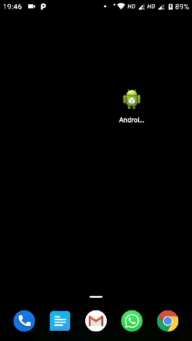

Five-Star-Me
============

Five-Star-Me is a library to help you promote your android app by prompting users to rate the app after using it for a few days.<br>
It uses Android's [In-App Review API](https://developer.android.com/guide/playcore/in-app-review) and is based upon @hotchemi's [Android-Rate](https://github.com/hotchemi/Android-Rate) library.

>Note: In order to test, the API requires the app be uploaded to the play store - *It connot be tested locally*. Read the testing guide [here](https://developer.android.com/guide/playcore/in-app-review/test).



## Install

You can download from jitpack.

```groovy
allprojects {
	repositories {
		...
		maven { url 'https://jitpack.io' }
	}
}
```

${latest.version} is 

```groovy
dependencies {
  implementation 'com.github.numerative:Five-Star-Me:{latest.version}'
}
```

## Usage

### Configuration

Android-Rate provides methods to configure its behavior.

```java
@Override
protected void onCreate(Bundle savedInstanceState) {
  super.onCreate(savedInstanceState);
  setContentView(R.layout.activity_main);

  FiveStarMe.with(this)
      .setInstallDays(0) // default 10, 0 means install day.
      .setLaunchTimes(3) // default 10
      .setDebug(false) // default false
      .monitor();

  // Show a dialog if meets conditions
  FiveStarMe.showRateDialogIfMeetsConditions(this);
}
```

The default conditions to show rate dialog is as below:

1. App is launched more than 10 days later than installation. Change via `FiveStarMe#setInstallDays(int)`.
2. App is launched more than 10 times. Change via `FiveStarMe#setLaunchTimes(int)`.
3. Setting `FiveStarMe#setDebug(boolean)` will ensure that the rating request is shown each time the app is launched. **This feature is only development!**.

### Clear show dialog flag

When you want to show the dialog again, call `FiveStarMe#clearAgreeShowDialog()`.

```java
FiveStarMe.with(this).clearAgreeShowDialog();
```

### When the button presses on

call `FiveStarMe#showRateDialog(Activity)`.

```java
FiveStarMe.with(this).showRateDialog(this);
```

## Support

Five-Star-Me supports API level 16 and up.

## Sample

Please try the [sample](https://github.com/numerative/Five-Star-Me/tree/master/sample) app. 

To test, provide `applicationId` to sample module's `build.gradle` and upload it to one of your test tracks on google play store.
```groovy
android {
    compileSdkVersion 29

    defaultConfig {
        applicationId "com.exmaple.yourappid"
        minSdkVersion 16
        targetSdkVersion 29
        versionCode 1
        versionName "1.0"
    }
```

## Contribute

1. Fork it
2. Create your feature branch (`git checkout -b my-new-feature`)
3. Commit your changes (`git commit -am 'Added some feature'`)
4. Push to the branch (`git push origin my-new-feature`)
5. Create new Pull Request

## License
```
The MIT License (MIT)

Copyright (c) 2015 Shintaro Katafuchi
Copyright (c) 2020 Michael Hathi

Permission is hereby granted, free of charge, to any person obtaining a copy
of this software and associated documentation files (the "Software"), to deal
in the Software without restriction, including without limitation the rights
to use, copy, modify, merge, publish, distribute, sublicense, and/or sell
copies of the Software, and to permit persons to whom the Software is
furnished to do so, subject to the following conditions:

The above copyright notice and this permission notice shall be included in
all copies or substantial portions of the Software.

THE SOFTWARE IS PROVIDED "AS IS", WITHOUT WARRANTY OF ANY KIND, EXPRESS OR
IMPLIED, INCLUDING BUT NOT LIMITED TO THE WARRANTIES OF MERCHANTABILITY,
FITNESS FOR A PARTICULAR PURPOSE AND NONINFRINGEMENT. IN NO EVENT SHALL THE
AUTHORS OR COPYRIGHT HOLDERS BE LIABLE FOR ANY CLAIM, DAMAGES OR OTHER
LIABILITY, WHETHER IN AN ACTION OF CONTRACT, TORT OR OTHERWISE, ARISING FROM,
OUT OF OR IN CONNECTION WITH THE SOFTWARE OR THE USE OR OTHER DEALINGS IN
THE SOFTWARE.
```